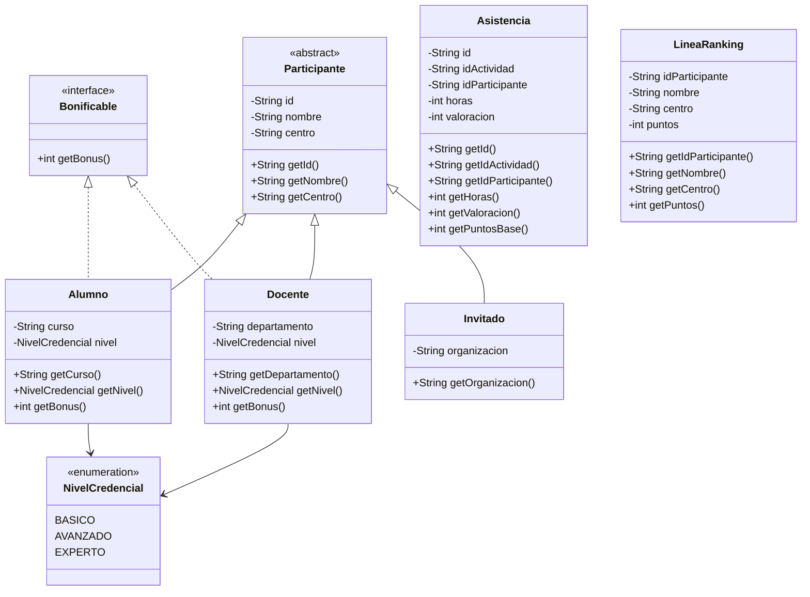
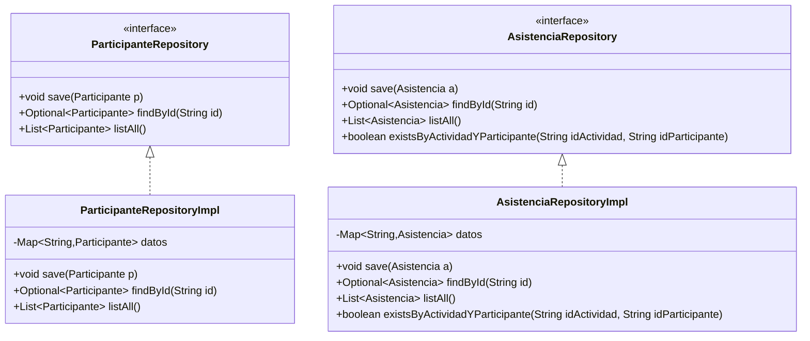
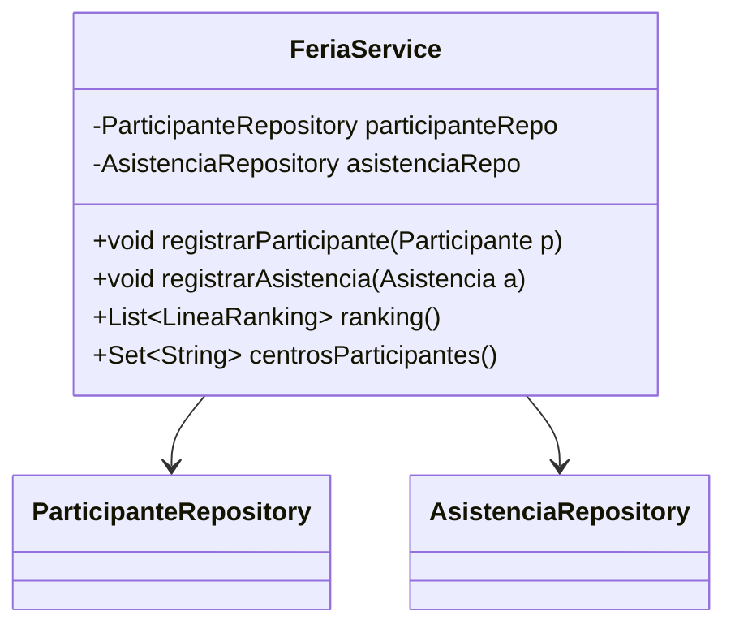

# **Examen práctico DAM1 — Programación + Entornos de Desarrollo**
---

## **Contexto**

El centro organiza una **Feria de Talento** (tipo jornada de talleres/charlas). Hay **participantes** (de distintos tipos) y **asistencias** a actividades.

Se pide una aplicación Java **de consola** para:

1. **Leer** participantes y asistencias desde ficheros (CSV)
2. Registrar la información en memoria
3. Calcular un **ranking por puntos** y consultas simples
4. **Escribir** el ranking a un fichero de salida

> Importante: este repositorio
>
>
> **no trae implementaciones**
>

---

# **1) Requisitos de Entornos de Desarrollo (ED)**

## **1.1 GitHub (Fork + Project + Issues + PR)**

1. Haz **FORK** de este repositorio a tu cuenta.
2. Crea un **GitHub Project** (tablero) en tu fork con estas columnas:
    - Pendiente (To do)
    - En proceso (In progress)
    - En revisión (In review)
    - Hecho (Done)
3. Crea **al menos 2 Issues** (tareas) y colócalos en el Project.
4. Trabaja con ramas feature/* (al menos **1 rama feature** durante el examen).
5. **Todo cambio que llegue a main debe entrar mediante una Pull Request (PR)** (no se permite merge directo).
6. Antes de hacer merge, realiza **auto revisión**: revisa la PR y deja **al menos 1 comentario** (puede ser un checklist corto tipo “compila / pasa tests / cumple requisitos”).

---

# **2) Requisitos de Maven (ED) — obligatorio**

## **2.1 Java**

El proyecto debe compilar con **Java 21**.

## **2.2 Dependencias obligatorias (añadir en pom.xml)**

Debes añadir exactamente estas dependencias y versiones:

- **Apache Commons CSV**
    - groupId: org.apache.commons
    - artifactId: commons-csv
    - version: 1.14.0
- **JUnit Jupiter (JUnit 5)**
    - groupId: org.junit.jupiter
    - artifactId: junit-jupiter
    - version: 5.14.2
    - scope: test
- **Mockito Core**
    - groupId: org.mockito
    - artifactId: mockito-core
    - version: 5.20.0
    - scope: test
- **Mockito JUnit Jupiter**
    - groupId: org.mockito
    - artifactId: mockito-junit-jupiter
    - version: 5.20.0
    - scope: test

## **2.3 Plugins**

- El plugin **maven-surefire-plugin** (tests) **ya está configurado** y **no tienes que tocarlo**.
- Debes configurar el plugin **exec-maven-plugin** para poder ejecutar con mvn exec:java:
    - groupId: org.codehaus.mojo
    - artifactId: exec-maven-plugin
    - version: 3.6.3
    - <mainClass>es.fplumara.dam1.feria.app.Main</mainClass>

✅ Debe poder ejecutarse:

- mvn clean test
- mvn exec:java

---

# **3) Requisitos de Programación**

## **3.1 Capas y paquetes**

Debes organizar el código por capas usando estos paquetes:

- es.fplumara.dam1.feria.app
- es.fplumara.dam1.feria.model
- es.fplumara.dam1.feria.repository
- es.fplumara.dam1.feria.service
- es.fplumara.dam1.feria.io
- es.fplumara.dam1.feria.exception

---

## **3.2 Diagrama de clases — Modelo**

✅ Debe existir:

- Una clase abstracta: Participante
- Tres clases hijas: Alumno, Docente, Invitado
- Una interfaz Bonificable implementada **solo por Alumno y Docente**
- Un enum NivelCredencial usado **solo por Alumno y Docente**
- Una clase Asistencia
- Una clase LineaRanking (DTO/record o clase normal)



### **3.2.1 Reglas de puntuación**

**Bonus por credencial (solo para Bonificable):**

- BASICO → 0
- AVANZADO → 1
- EXPERTO → 2

> Esta lógica debe estar en getBonus() de Alumno y Docente (usan el enum NivelCredencial).
>

> Invitado **no** implementa Bonificable, **no** tiene nivel y su bonus es 0.
>

**Puntos base por asistencia (en Asistencia.getPuntosBase()):**

- puntosBase = horas + valoracion
- horas debe ser mayor que 0 
- valoracion entre 1 y 5 (incluidos) 

**Puntos totales para ranking (en el Service):**

- puntosTotales = puntosBase + bonusParticipante
- bonus:
    - si el participante es Bonificable → getBonus()
    - si es Invitado → 0

---

## **3.3 Repositorios**

Los repositorios almacenan datos en memoria usando Map internamente.

✅ Deben existir **2 repositorios** (no genéricos):

- ParticipanteRepository
- AsistenciaRepository

Cada repositorio tendrá su implementación *Impl con un Map como almacenamiento.

> **Importante:** las validaciones y reglas (duplicados, existencia, etc.) se realizan en el **Service**, no en el Repository
>



**Nota:** Optional es de java.util.Optional.

### **Qué hace cada método**

**ParticipanteRepository**

- save(p): guarda en memoria (Map).
- findById(id): busca por id → Optional.empty() si no existe.
- listAll(): devuelve lista con todos los participantes.

**AsistenciaRepository**

- save(a): guarda en memoria (Map).
- findById(id): busca por id → Optional.empty() si no existe.
- listAll(): devuelve lista con todas las asistencias.
- existsByActividadYParticipante(idActividad, idParticipante): devuelve true si ya hay una asistencia con esa actividad y participante.

---

## **3.4 Servicio**



### **3.4.1 Excepciones propias**

Crea y usa estas excepciones en ...exception:

- DuplicadoException
- NoEncontradoException
- OperacionNoPermitidaException

### **3.4.2 FeriaService**

- `void registrarParticipante(Participante p)`
- `void registrarAsistencia(Asistencia a)`
- `List<LineaRanking> ranking()`
- `Set<String> centrosParticipantes()`

### **3.4.3 Reglas del service**

### **`registrarParticipante(Participante p)`**

- Si p es null o id/nombre/centro es null/vacío → IllegalArgumentException
- Si ya existe un participante con ese id → DuplicadoException
- Validaciones por subtipo:
    - Alumno: curso no null/vacío y nivel no null
    - Docente: departamento no null/vacío y nivel no null
    - Invitado: organizacion no null/vacío
- Si todo ok → guarda

### **`registrarAsistencia(Asistencia a)`**

- Si a es null o id/idActividad/idParticipante es null/vacío → IllegalArgumentException
- Si horas <= 0 → IllegalArgumentException
- Si valoracion < 1 o valoracion > 5 → IllegalArgumentException
- Si ya existe una asistencia con ese id → DuplicadoException
- Si el participante no existe → NoEncontradoException
- Regla: un participante **solo puede registrar 1 asistencia por actividad**
    - Si asistenciaRepo.existsByActividadYParticipante(idActividad, idParticipante) → OperacionNoPermitidaException
- Si todo ok → guarda

### **`ranking() -> List<LineaRanking>`**

- Recorre las asistencias y acumula la puntuación total de cada participante teniendo en cuenta la puntuación base de la asistencia y, si procede, la bonificación por credencial.
- Devuelve el ranking ordenado por puntuación de mayor a menor; si hay empate, se desempata por nombre en orden alfabético.
- Solo aparecen en el ranking quienes tengan al menos una asistencia registrada.

### **`centrosParticipantes() -> Set<String>`**

- Devuelve el conjunto (sin repetidos) de centro de los participantes registrados.

---

## **3.5 Lectura y escritura de ficheros (CSV) con Apache Commons CSV**

### **Entrada participantes.csv**

```csv
tipo,id,nombre,centro,curso,departamento,organizacion,nivel
ALUMNO,P001,Ana,IES_LUMARA,1DAM,,,AVANZADO
DOCENTE,P002,Bruno,IES_LUMARA,,Informatica,,EXPERTO
INVITADO,P003,Carla,Empresa_X,,,TechCorp,
```

Reglas:

- tipo debe ser exactamente: ALUMNO, DOCENTE o INVITADO (sin espacios).
- ALUMNO: curso y nivel obligatorios
- DOCENTE: departamento y nivel obligatorios
- INVITADO: organizacion obligatoria y nivel debe venir vacío
- tipo desconocido → IllegalArgumentException (o excepción propia)

### **Entrada asistencias.csv**

```csv
id,idActividad,idParticipante,horas,valoracion
A001,T001,P001,2,4
A002,T001,P002,2,5
A003,T002,P001,1,3
A004,T003,P003,2,5
```

### **Salida ranking.csv**

```csv
idParticipante,nombre,centro,puntos
P001,Ana,IES_LUMARA,?
P002,Bruno,IES_LUMARA,?
P003,Carla,Empresa_X,?
```

---

| **Nota**: La lectura/escritura de CSV ya está implementada en el paquete es.fplumara.dam1.feria.io. El alumno solo debe transformar entre *CsvRow y su modelo de dominio.

```java

ParticipanteCsvReader pr = new ParticipanteCsvReader();
AsistenciaCsvReader ar = new AsistenciaCsvReader();

List<ParticipanteCsvRow> participantesDto = pr.read("participantes.csv");
List<AsistenciaCsvRow> asistenciasDto = ar.read("asistencias.csv");

List<RankingCsvRow> out;
new RankingCsvWriter().write("ranking.csv", out);
```

# **4) Tests unitarios (JUnit + Mockito) — obligatorio**

Debes crear tests unitarios **únicamente del método ranking() de FeriaService** usando JUnit 5 y Mockito.

**Objetivo:** demostrar que sabes **cuándo usar mocks** (repositorios) y cuándo **no hace falta** (objetos de dominio).

### **4.1 Requisitos obligatorios**

- Usar @ExtendWith(MockitoExtension.class).
- Crear **mocks solo de los repositorios**:
    - @Mock ParticipanteRepository participanteRepo
    - @Mock AsistenciaRepository asistenciaRepo
- Construir FeriaService con esos mocks (con @InjectMocks o por constructor).
- Los objetos de dominio (Alumno, Docente, Invitado, Asistencia) deben ser **reales** (no mocks).
- En cada test se debe preparar el comportamiento de los repos con when(...).thenReturn(...) (por ejemplo, listAll()).
- En cada test debe aparecer al menos un verify(...) comprobando que se ha llamado a listAll() del repositorio correspondiente.

### **4.2 Casos mínimos a cubrir**

1. **Suma de puntos y bonus**
    - Prepara un Alumno o Docente (que implemente Bonificable) con un NivelCredencial.
    - Prepara al menos una Asistencia.
    - Comprueba que el total de puntos del ranking es:

      horas + valoracion + bonus.

2. **Ordenación del ranking**
    - Prepara **dos participantes** con puntuaciones distintas.
    - Comprueba que el ranking queda ordenado por puntos en **orden descendente**.
3. **Participantes sin asistencias no aparecen**
    - Prepara un participante sin asistencias asociadas.
    - Comprueba que **no aparece** en el List<LineaRanking>.

---

# **5) Programa principal**

En app.Main flujo simple:

Sigue las indicaciones de los comentarios para completar el contenido de `es.fplumara.dam1.feria.app.Main`

---

## **Entrega**

- Enlace a tu fork
- mvn clean test
- mvn exec:java
- PRs y Project reflejan tu trabajo