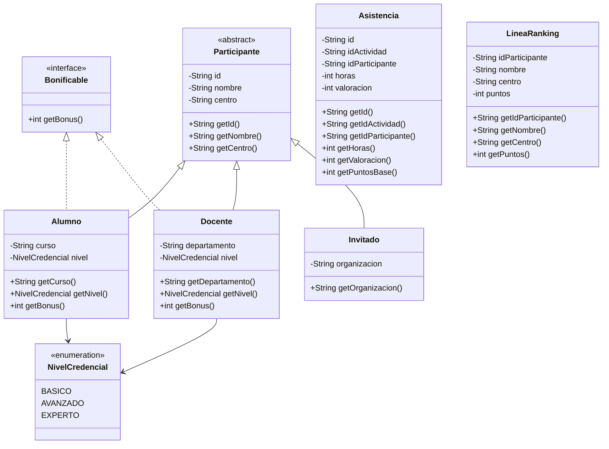
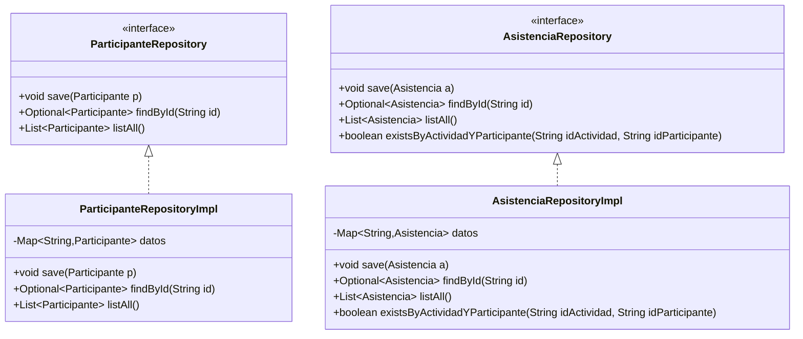
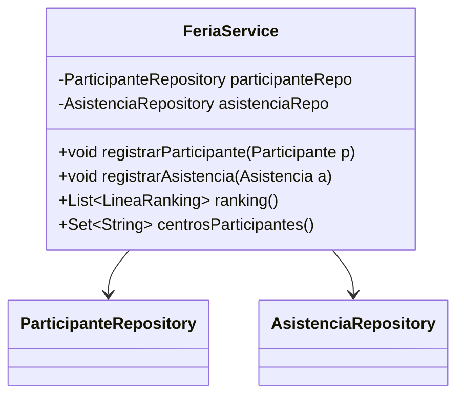

# **Practical Exam DAM1 — Programming + Development Environments**

---

## **Context**

The school is organizing a **Talent Fair** (like a workshop/talk day). There are **participants** (of different types) and **attendance records** for activities.

You must build a **console** Java application to:

1. **Read** participants and attendance records from files (CSV)
2. Store the information in memory
3. Compute a **points-based ranking** and simple queries
4. **Write** the ranking to an output file

> Important: this repository
>

>
>

> **does not include implementations**
>

---

# **1) Development Environments (DE) Requirements**

## **1.1 GitHub (Fork + Project + Issues + PR)**

1. **FORK** this repository to your account.
2. Create a **GitHub Project** (board) in your fork with these columns:
    - Pending (To do)
    - In progress
    - In review
    - Done
3. Create **at least 2 Issues** (tasks) and place them in the Project.
4. Work with feature/* branches (at least **1 feature branch** during the exam).
5. **Every change that reaches main must go through a Pull Request (PR)** (direct merge is not allowed).
6. Before merging, do a **self-review**: review the PR and leave **at least 1 comment** (it can be a short checklist like “compiles / tests pass / meets requirements”).

---

# **2) Maven (DE) Requirements — mandatory**

## **2.1 Java**

The project must compile with **Java 21**.

## **2.2 Mandatory dependencies (add in pom.xml)**

You must add exactly these dependencies and versions:

- **Apache Commons CSV**
    - groupId: org.apache.commons
    - artifactId: commons-csv
    - version: 1.14.0
- **JUnit Jupiter (JUnit 5)**
    - groupId: org.junit.jupiter
    - artifactId: junit-jupiter
    - version: 5.14.2
    - scope: test
- **Mockito Core**
    - groupId: org.mockito
    - artifactId: mockito-core
    - version: 5.20.0
    - scope: test
- **Mockito JUnit Jupiter**
    - groupId: org.mockito
    - artifactId: mockito-junit-jupiter
    - version: 5.20.0
    - scope: test

## **2.3 Plugins**

- The **maven-surefire-plugin** (tests) **is already configured** and **you don’t need to touch it**.
- You must configure **exec-maven-plugin** so it can run with mvn exec:java:
    - groupId: org.codehaus.mojo
    - artifactId: exec-maven-plugin
    - version: 3.6.3
    - <mainClass>es.fplumara.dam1.feria.app.Main</mainClass>

✅ It must be runnable with:

- mvn clean test
- mvn exec:java

---

# **3) Programming Requirements**

## **3.1 Layers and packages**

You must organize the code by layers using these packages:

- es.fplumara.dam1.feria.app
- es.fplumara.dam1.feria.model
- es.fplumara.dam1.feria.repository
- es.fplumara.dam1.feria.service
- es.fplumara.dam1.feria.io
- es.fplumara.dam1.feria.exception

---

## **3.2 Class diagram — Model**

✅ Must exist:

- An abstract class: Participante
- Three child classes: Alumno, Docente, Invitado
- An interface Bonificable implemented **only by Alumno and Docente**
- An enum NivelCredencial used **only by Alumno and Docente**
- A class Asistencia
- A class LineaRanking (DTO/record or normal class)



### **3.2.1 Scoring rules**

**Credential bonus (only for Bonificable):**

- BASICO → 0
- AVANZADO → 1
- EXPERTO → 2

> This logic must be in getBonus() of Alumno and Docente (they use the NivelCredencial enum).
>

> Invitado **does not** implement Bonificable
>

**Base points per attendance (in Asistencia.getPuntosBase()):**

- puntosBase = horas + valoracion
- horas must be greater than 0
- valoracion between 1 and 5 (inclusive)

**Total points for ranking (in the Service):**

- puntosTotales = puntosBase + bonusParticipante
- bonus:
    - if the participant is Bonificable → getBonus()
    - if it is Invitado → 0

---

## **3.3 Repositories**

Repositories store data in memory using a Map internally.

✅ There must be **2 repositories** (not generic):

- ParticipanteRepository
- AsistenciaRepository

Each repository will have an *Impl implementation with a Map as storage.

> **Important**: validations and rules (duplicates, existence, etc.) are enforced in the Service, not in the Repository.
>



**Note:** Optional is from java.util.Optional.

### **What each method does**

**ParticipanteRepository**

- save(p): saves in memory (Map).
- findById(id): searches by id → Optional.empty() if it doesn’t exist.
- listAll(): returns a list with all participants.

**AsistenciaRepository**

- save(a): saves in memory (Map).
- findById(id): searches by id → Optional.empty() if it doesn’t exist.
- listAll(): returns a list with all attendances.
- existsByActividadYParticipante(idActividad, idParticipante): returns true if there is already an attendance with that activity and participant.

---

## **3.4 Service**



### **3.4.1 Custom exceptions**

Create and use these exceptions in …exception:

- DuplicadoException
- NoEncontradoException
- OperacionNoPermitidaException

### **3.4.2 FeriaService**

- void registrarParticipante(Participante p)
- void registrarAsistencia(Asistencia a)
- List<LineaRanking> ranking()
- Set<String> centrosParticipantes()

### **3.4.3 Service rules**

### **registrarParticipante(Participante p)**

- If p is null or id/nombre/centro are null/empty → IllegalArgumentException
- If a participant with that id already exists → DuplicadoException
- Subtype validations:
    - Alumno: curso not null/empty and nivel not null
    - Docente: departamento not null/empty and nivel not null
    - Invitado: organizacion not null/empty
- If everything is OK → save

### **registrarAsistencia(Asistencia a)**

- If a is null or id/idActividad/idParticipante are null/empty → IllegalArgumentException
- If horas <= 0 → IllegalArgumentException
- If valoracion < 1 or valoracion > 5 → IllegalArgumentException
- If an attendance with that id already exists → DuplicadoException
- If the participant doesn’t exist → NoEncontradoException
- Rule: a participant **can only register 1 attendance per activity**
    - If asistenciaRepo.existsByActividadYParticipante(idActividad, idParticipante) → OperacionNoPermitidaException
- If everything is OK → save

### **ranking() -> List<LineaRanking>**

- Iterate through attendance records and accumulate the total score of each participant considering the base score of the attendance and, where applicable, the credential bonus.
- Return the ranking ordered by score from highest to lowest; if there’s a tie, break it by name in alphabetical order.
- Only participants with at least one registered attendance appear in the ranking.

### **centrosParticipantes() -> Set<String>**

- Return the set (no duplicates) of the centro of registered participants.

---

## **3.5 Reading and writing files (CSV) with Apache Commons CSV**

### **Input participantes.csv**

```csv
tipo,id,nombre,centro,curso,departamento,organizacion,nivel
ALUMNO,P001,Ana,IES_LUMARA,1DAM,,,AVANZADO
DOCENTE,P002,Bruno,IES_LUMARA,,Informatica,,EXPERTO
INVITADO,P003,Carla,Empresa_X,,,TechCorp,
```

Rules:

- tipo must be exactly: ALUMNO, DOCENTE, or INVITADO (no spaces).
- ALUMNO: curso and nivel are mandatory
- DOCENTE: departamento and nivel are mandatory
- INVITADO: organizacion is mandatory and nivel must be empty
- Unknown tipo → IllegalArgumentException (or a custom exception)

### **Input asistencias.csv**

```csv
id,idActividad,idParticipante,horas,valoracion
A001,T001,P001,2,4
A002,T001,P002,2,5
A003,T002,P001,1,3
A004,T003,P003,2,5
```

### **Output ranking.csv**

```csv
idParticipante,nombre,centro,puntos
P001,Ana,IES_LUMARA,?
P002,Bruno,IES_LUMARA,?
P003,Carla,Empresa_X,?
```

---

| **Note**: CSV reading/writing is already implemented in the package es.fplumara.dam1.feria.io. The student only needs to transform between *CsvRow and their domain model.

```java
ParticipanteCsvReader pr = new ParticipanteCsvReader();
AsistenciaCsvReader ar = new AsistenciaCsvReader();

List<ParticipanteCsvRow> participantesDto = pr.read("participantes.csv");
List<AsistenciaCsvRow> asistenciasDto = ar.read("asistencias.csv");

List<RankingCsvRow> out;
new RankingCsvWriter().write("ranking.csv", out);
```

# **4) Unit tests (JUnit + Mockito) — mandatory**

You must create unit tests **only for the ranking() method of FeriaService** using JUnit 5 and Mockito.

**Goal:** prove you know **when to use mocks** (repositories) and when **you don’t need them** (domain objects).

### **4.1 Mandatory requirements**

- Use @ExtendWith(MockitoExtension.class).
- Create **mocks only for repositories**:
    - @Mock ParticipanteRepository participanteRepo
    - @Mock AsistenciaRepository asistenciaRepo
- Build FeriaService with those mocks (with @InjectMocks or via constructor).
- Domain objects (Alumno, Docente, Invitado, Asistencia) must be **real** (not mocks).
- In each test, prepare repository behavior with when(...).thenReturn(...) (e.g., listAll()).
- In each test, include at least one verify(...) checking that listAll() was called on the corresponding repository.

### **4.2 Minimum cases to cover**

1. **Sum of points and bonus**
    - Prepare an Alumno or Docente (implements Bonificable) with a NivelCredencial.
    - Prepare at least one Asistencia.
    - Check that the total ranking points are:

      horas + valoracion + bonus.

2. **Ranking ordering**
    - Prepare **two participants** with different scores.
    - Check that the ranking is ordered by points in **descending** order.
3. **Participants without attendances do not appear**
    - Prepare a participant with no linked attendances.
    - Check that they **do not appear** in the List<LineaRanking>.

---

# **5) Main program**

In app.Main, a simple flow:

Follow the instructions in the comments to complete the content of es.fplumara.dam1.feria.app.Main.

---

## **Submission**

- Link to your fork
- mvn clean test
- mvn exec:java
- PRs and Project reflect your work
